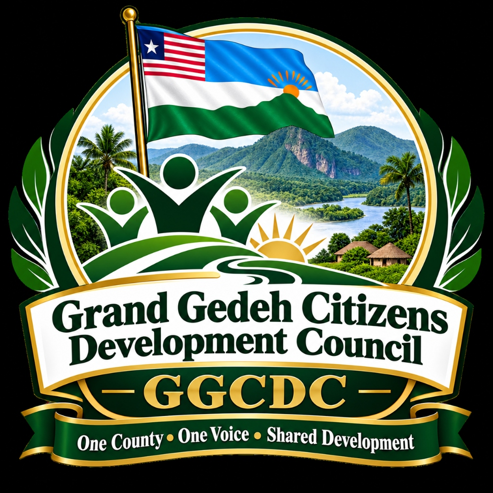

# Grand Gedeh Citizens Development Council (GGCDC)
## Grand Gedeh Development Intelligence, Participation & Accountability Platform

**Motto**: *"One County • One Voice • Shared Development"*  
**Sub-title**: *"Building informed participation, accountable investment and sustainable development across Grand Gedeh."*



---

## 🏛️ Executive Summary & Institutional Mission

The **Grand Gedeh Citizens Development Council (GGCDC)** is designed as a **permanent county-development institution**, with **Putu as its first major case study**—not as an organization whose existence depends on one mine.

This digital platform operates as Grand Gedeh's central **Development Intelligence, Participation & Accountability Platform**: one integrated digital system where citizens, customary communities, professionals, local businesses, diaspora members, investors, and public institutions understand what is happening in the county, contribute expertise, participate in consultations, track commitments, and organize around economic development opportunities.

---

## 🏗️ Institutional Hierarchy

```
Grand Gedeh Citizens Development Council (GGCDC)
└── Natural Resources, Investment & Development Portfolio
    └── Specialized Sector Arms (8 Permanent Directorates)
        └── Individual Projects, Concessions & Initiatives
            └── Mining & Extractives
                └── GGCDC Putu Mining & Development Working Group (Putu Iron Ore Flagship)
```

If another mineral, forestry, or agricultural concession appears five or ten years from now, GGCDC creates another project workspace without redesigning the entire institution.

---

## 🌐 The Five Core Operating Systems

1. **County Development Observatory**: Multi-layer interactive GIS map, district spatial boundary data, natural resource surveys, and economic analytics.
2. **Citizens Participation Platform**: Customary community profiles, public consultation portals, grievances, and authentic town attendance records.
3. **Investment & Accountability Platform**: Concession master registry, contractual promises, public revenue disclosures, and commitments tracker.
4. **Economic Opportunity Platform**: Verified local supplier database, countywide workforce registry, skills gap modeler, and tenders hub.
5. **GGCDC Institutional Workspace**: Specialized directorates, technical advisory network, risk registers, confidential briefs, and institutional document repository.

---

## 🌿 The Eight Permanent Development Directorates (Pillars)

1. **Mining & Extractives**: Putu and future mineral projects, agreements, communities, employment, environmental commitments, infrastructure, royalties/community benefits, and local procurement.
2. **Forestry, Environment & Climate**: Commercial concessions (Singbeh, etc.), community forests, Grebo-Krahn National Park buffer zone, logging operations, carbon credits, and reforestation.
3. **Agriculture & Food Systems**: Smallholder farmers, cooperatives, commercial farms (Cavalla rubber & oil palm), processing mini-mills, off-takers, and farm-to-market feeder roads.
4. **Infrastructure & Public Utilities**: Ganta-Tapeta-Zwedru highway paving, bridges, 225kV CLSG electricity grid, rural mini-grids, water points, and telecom towers.
5. **Concessions, Investment & PPPs**: Database of concessions and major investors, agreements, beneficial ownership, obligations, timelines, and status scorecards.
6. **Local Enterprise, Jobs & Skills**: Grand Gedeh business registry, verified supplier database, workforce database, skills inventory, tenders, and youth TVET apprenticeships.
7. **Land, Communities & Social Development**: Customary communities, affected areas, community agreements (CDAs), grievance redress, women/youth inclusion, education, and health.
8. **Governance, Research & Citizen Participation**: Consultations, public submissions, professional committees, policy research, meeting records, resolutions, and commitment monitoring.

---

## 🚀 Key Functional Capabilities

- **Interactive GIS Development Map**: Toggle layers for mining concessions, forest reserves, agricultural belts, customary communities, road corridors, clinics, schools, and CLSG electrical grids.
- **Commitments & Benefits Tracker**: Audit ledger recording who promised, to whom, source clause, monetary value, delivery deadlines, and verifiable evidence.
- **Investor Skills Gap Calculator**: Empirical tool allowing concessionaires to model labor demands and calculate verified qualified workers, cross-skilling requirements, and TVET apprentice covenants.
- **Technical & Professional Advisory Network**: Structured home for diaspora and local experts across law, mining, engineering, economics, and ecology (aligned with President Poah's GGAA initiative).
- **Public Portal vs. Secure Institutional Workspace (RBAC)**: Interactive role switching between Citizens, Investors, Technical Experts, Secretariat Administrators, and Traditional Paramount Chiefs.

---

## 💻 Tech Stack & Deployment

- **Frontend**: React 19, TypeScript, Vite, Tailwind CSS
- **Icons & UI Tokens**: Lucide-react, custom Radix-style drawer primitives
- **Interactive GIS**: Precision SVG vector projection with dynamic coordinate markers
- **Build System**: Clean static bundle output for GitHub Pages / CDN edge deployment

---

## 🛠️ Local Development & Build

```bash
# Clone the repository
git clone https://github.com/totagits/grand-gedeh-cdc-platform.git

# Install dependencies
npm install

# Run development server
npm run dev

# Compile TypeScript and build production bundle
npm run build

# Preview production build locally
npm run preview
```

---

## 📜 License & Governance

Managed under the authority of the **Grand Gedeh Citizens Development Council (GGCDC)**.  
*Republic of Liberia • Grand Gedeh County • Zwedru Central Secretariat*
